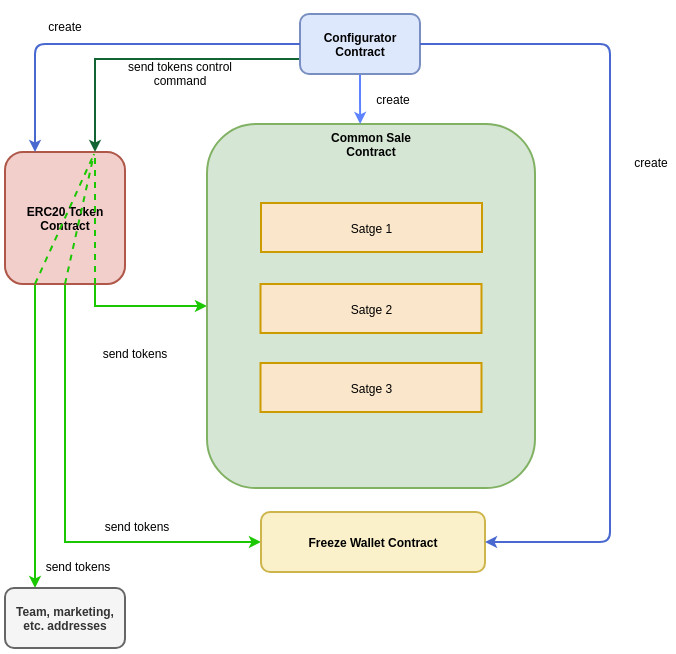

# 10Set Token smart contract

* _Standart_        : [ERC20](https://github.com/ethereum/EIPs/blob/master/EIPS/eip-20.md)
* _[Name](https://github.com/ethereum/EIPs/blob/master/EIPS/eip-20.md#name)_            : 10Set Token
* _[Ticker](https://github.com/ethereum/EIPs/blob/master/EIPS/eip-20.md#symbol)_          : 10SET
* _[Decimals](https://github.com/ethereum/EIPs/blob/master/EIPS/eip-20.md#decimals)_        : 18
* _Emission_        : Single, 210 000 000 tokens
* _Fiat dependency_ : No
* _Token offers_    : 3
* _Token locks_     : No

## Smart-contracts description

10SET Token smart-contract

### Contracts:
1. _TenSETToken_ - Token contract
2. _CommonSale_ - Sale contract 
3. _FreezeWallet_ - A wallet for frozen team tokens. The total freezing period is 30 months. Every 3 months, 10% of the initial amount is unfrozen and transferred to the Team's wallet.
4. _Configurator_

### Contracts arch

### Contract features

#### RFI mechanism
1. 1% distributed proportionally to all token holder with every transaction
2. Ability to block some addresses from receiving staking bonus (exchange liquidity pools)

#### Token burning mechanism
1. 1% is burned with every transaction
2. Burning process stops when the total number of tokens drops to 1% (2,100,000)

### How to manage contract
To start working with contract you should follow next steps:
1. Compile it in Remix with enamble optimization flag and compiler 0.6.2
2. Deploy bytecode with MyEtherWallet. Gas 5100000 (actually 5073514).
3. Call 'deploy' function on addres from (3). Gas 4000000 (actually 3979551). 

### Wallets with ERC20 support
1. MyEtherWallet - https://www.myetherwallet.com/
2. Parity 
3. Mist/Ethereum wallet

EXODUS not support ERC20, but have way to export key into MyEtherWallet - http://support.exodus.io/article/128-how-do-i-receive-unsupported-erc20-tokens

## Main network configuration 

### Token distibution
1. Company Reserve + marketing (15%): 31,500,000 
2. Liquid Reserve (5%)              : 10,500,000
3. Team (10%)                       : 21,500,000
5. Sales stages                     : 143,500,000

### Sale stages

common price: 1 ETH = 10000 10SET

#### Stage 1
* Minimum purchase volume           : 0.1 ETH
* Maximum purchase volume           : 40ETH
* Bonus                             : 10%
* HardCap                           : 11,000,000 10SET
* Start date                        : 31/01/2021 (7pm GMT+1 time) (1612072800)
* End date                          : 07/02/2021 (7pm GMT+1 time) (1612677600)

#### Stage 2
* Minimum purchase volume           : 0.1 ETH
* Maximum purchase volume           : 100 ETH
* Bonus                             : 5%
* HardCap                           : 52,500,000 10SET
* Start date                        : 07/03/2021 (7pm GMT+1 time) (1612677600)
* End date                          : 14/03/2021 (7pm GMT+1 time) (1613282400)

#### Stage 3
* Minimum purchase volume           : 0 ETH
* Maximum purchase volume           : 9999999999999999999999 ETH
* Bonus                             : 0%
* HardCap                           : 80,000,000 10SET
* Start date                        : 14/03/2021 (7pm GMT+1 time) (1613282400)
* End date                          : 14/03/9999 (7pm GMT+1 time) (253374588000)

### Links 
1. _TenSETToken_ contract         :
2. _CommonSale_ contract          :
3. _FreezeWallet_ contract        :
4. _Configurator_ contract        :
5. ETH wallet address             :
6. Company reserve wallet address :
7. Liquid Reserve wallet address  :
8. Contracts admin address        :

### Addresses 
1. _TenSETToken_ contract         :
2. _CommonSale_ contract          :
3. _FreezeWallet_ contract        :
4. _Configurator_ contract        :
5. ETH wallet address             :
6. Company reserve wallet address :
7. Liquid Reserve wallet address  :
8. Contracts admin address        :

### Transactions

## Test network configuration (Ropsten)
