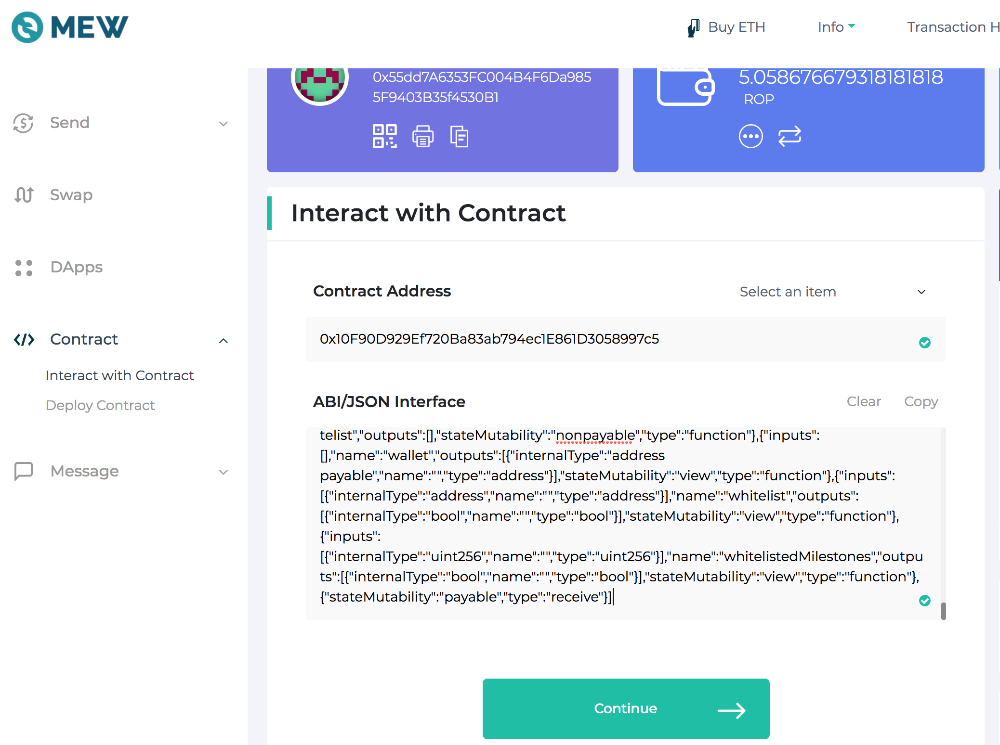
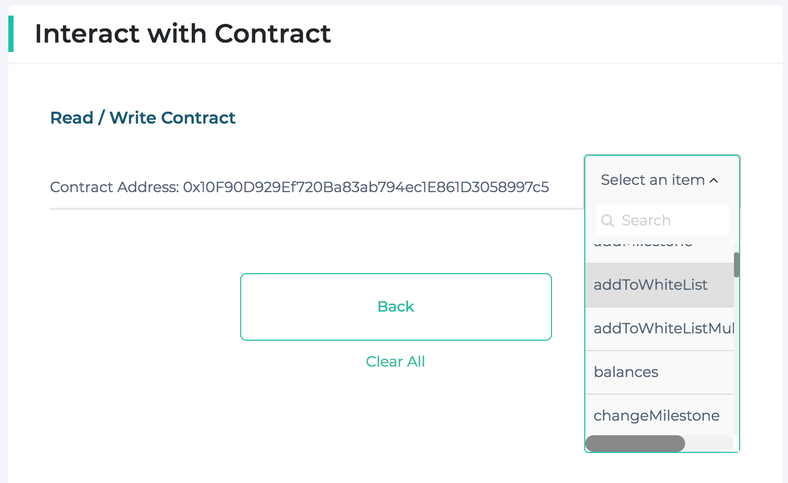
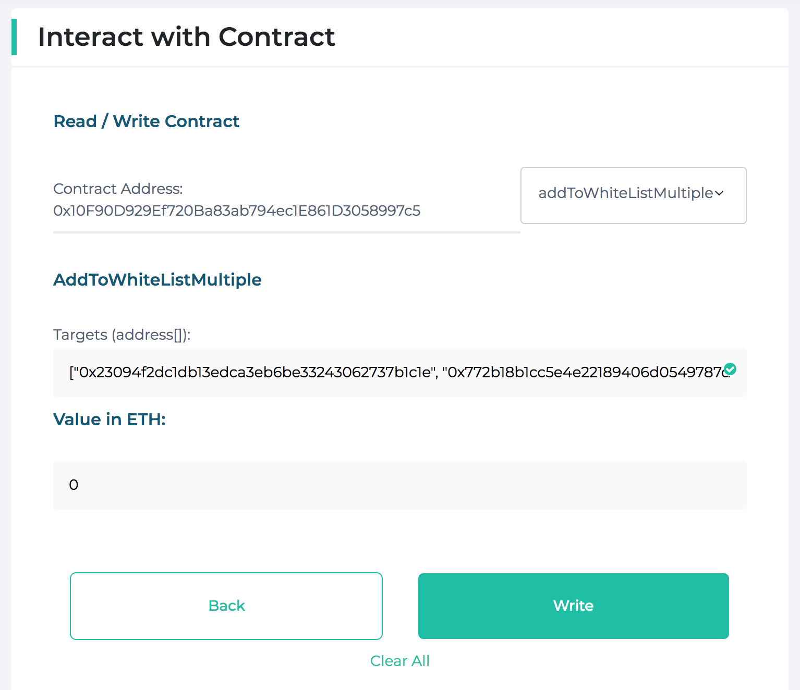

# The basics of smart contract interaction

> Attention! Some screenshots may contain addresses other than those actually used on the main network.
> Please, use the addresses provided in the body of this document or in the README file.

### Table of contents
* [Overview](#overview)
* [Obtaining the ABI interface](#obtaining-the-abi-interface)
* [Calling function](#calling-function)
* [How to whitelist addresses](#how-to-whitelist-addresses)
* [How to withdraw tokens from freezeWallet](#how-to-withdraw-tokens-from-freezewallet)
* [How to read contract information using Etherscan](#how-to-read-contract-information-using-etherscan)

## Overview
Interaction with the smart contract is provided by calling smart contract functions with parameters.  
* First, you need to find out the `address` of the smart contract.
* With the address, you can get the `ABI interface`.
* Using the `ABI` you can call the target `function` of the smart contract.

## Obtaining the ABI interface

1. Go to the [etherscan.io](https://etherscan.io).
2. Enter smart contract address in the field `Search by address` and click `Search` button.
3. Go to the `Contract` section.

4. Click `Code` button
    

Click to see screenshot

    

    

5. Scroll down until you reach the `Contract ABI` section. Click `Copi ABI to clipboard` button.
    

Click to see screenshot

    

    

## Calling function
1. Go to [myetherwallet.com](https://www.myetherwallet.com).
2. Sign in as described in **Accessing your wallet** section of user's manual.
3. Go to the `Interact wit Contract` section. Fill `Contract address` and `ABI/JSON Interface` fields (use ABI obtained in the [previous](#obtaining-the-abi-interface) section). Click `Continue` button.
    

Click to see screenshot

    

    

4. Select the required function from the drop-down list
    

Click to see screenshot

    

    

5. Fill in the parameter fields. Click `write` button. 
    

Click to see screenshot

    

    

6. Click `Confirm and send` button. You can see your transaction at [etherscan.io](https://etherscan.io).

>Attention! Carefully check the entered data Before clicking `write` button. Sometimes the data format differs from the usual presentation.

## How to whitelist addresses
The CommonSale contract has two methods for whitelisting addresses:
* addToWhiteList - to add exactly one address to whitelist. Reverts if address is already whitelisted.
* addToWhiteListMultiple - this function takes an array as input. Allows you to add multiple addresses in one transaction.
>Only owner of the smart contract can call service functions.

1. To add multiple addresses follow steps 1-4 of the [Calling function](#calling-function) section.
2. Fill `Targets` field. We recommend passing at most 100-200 addresses per function call. Addresses should be enclosed in square brackets, separated by commas. Each address must be enclosed in quotes.
    

Click to see screenshot

   
    
   
    

3. Click `write` button. Then click `Confirm and send`.

## How to withdraw tokens from freezeWallet
The FreezeWallet contract releases 2,100,000 tokens each 90 days.
In order to get released tokens [team wallet owner](https://etherscan.io/address/0x44c4a8d57b22597a2c0397a15cf1f32d8a4ea8f7) should [call](#calling-function) `retrieveWalletTokens` function with the target address passed as a parameter.
You can specify any address as `target` for receiving tokens.

## How to read contract information using Etherscan
Another way to read and smart contract information is to use interface provided by [Etherscan](https://etherscan.io).  
The first steps are similar to those described in the section [Obtaining the ABI interface](#obtaining-the-abi-interface):
1. Go to the [etherscan.io](https://etherscan.io).
2. Enter smart contract address in the field `Search by address` and click `Search` button.
3. Go to the `Contract` section.
4. Click `Read Contract` button. Now you can access contract's public information. You don't need to create a transaction to `read` the contract.
    

Click to see screenshot

    

    

